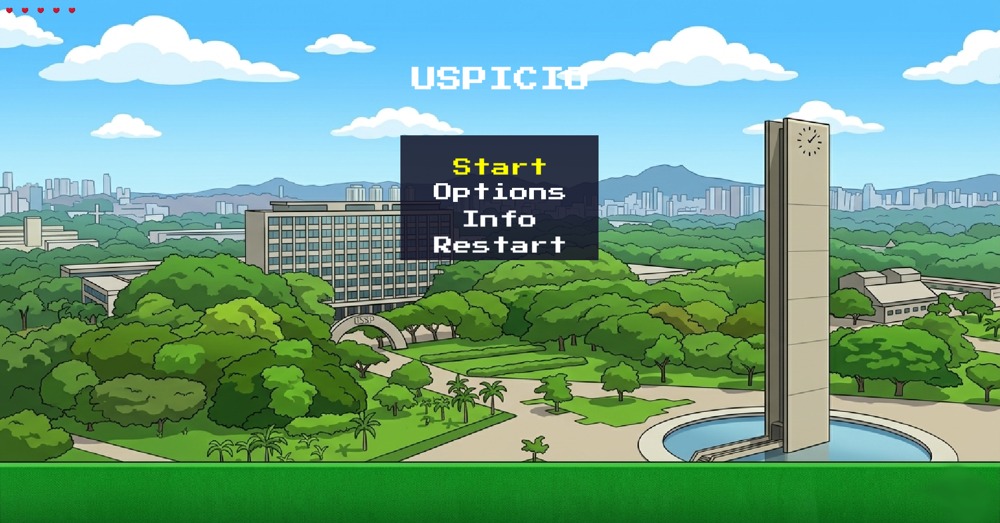
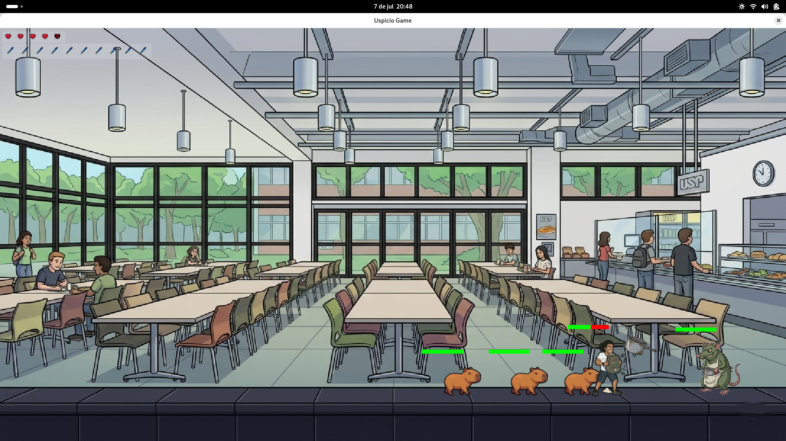
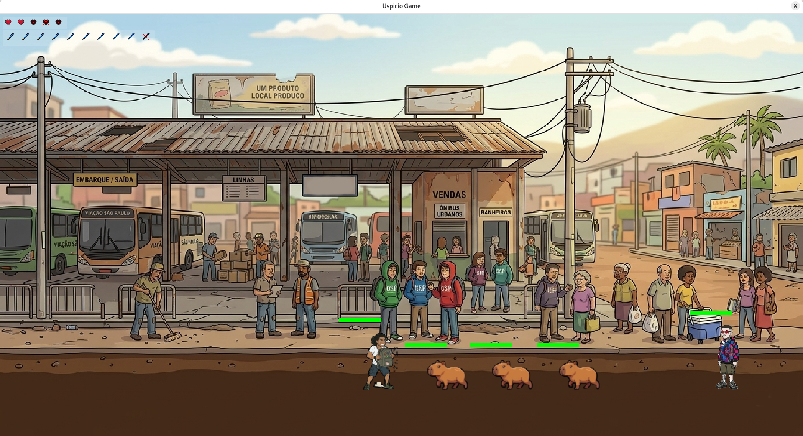
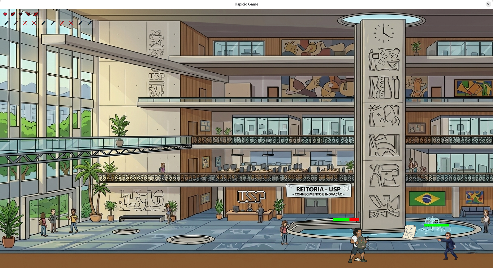

<p align="center">
  
</p>

<h1 align="center">🏛️ Uspício Game</h1>

<p align="center">
  <em>Beat 'em up side-scrolling inspirado na vida universitária da USP.<br>Enfrente capivaras, chefes icônicos e tente sobreviver até a formatura.</em>
</p>

<p align="center">
  <a href="https://github.com/Kelson-leo/USPicio_game_in_SFML-Cpp/actions"></a>
  <a href="https://github.com/Kelson-leo/USPicio_game_in_SFML-Cpp/blob/main/LICENSE"></a>
  <a href="https://kelson-leo.github.io/USPicio_game_in_SFML-Cpp/"></a>
  
  
  
</p>

---

<p align="center">
  <a href="#-english-summary">🇬🇧 English</a> &nbsp;|&nbsp;
  <a href="#-o-jogo">🎮 O Jogo</a> &nbsp;|&nbsp;
  <a href="#-fases">🗺️ Fases</a> &nbsp;|&nbsp;
  <a href="#-como-rodar">⚙️ Como Rodar</a> &nbsp;|&nbsp;
  <a href="#-arquitetura">🏗️ Arquitetura</a> &nbsp;|&nbsp;
  <a href="#-tecnologias">🔧 Tecnologias</a> &nbsp;|&nbsp;
  <a href="#-deploy-online">🌐 Deploy Online</a>
</p>

---

## 🇬🇧 English Summary

**Uspício Game** is an open-source 2D side-scrolling beat 'em up built in **C++23** with **SFML 3.x (VRSFML)**. The player takes the role of a USP student fighting capybaras and legendary professors across 7 phases inspired by real university landmarks. The game runs natively on **Linux** and in the **browser via WebAssembly** (Emscripten).

- **Architecture:** Hexagonal (Ports & Adapters) with strict separation between domain core and SFML infrastructure — the core has zero dependencies on any external library.
- **Design Patterns:** State, Strategy, Factory Method, Singleton (controlled).
- **Testing:** TDD with Google Test (110+ unit tests), no SFML dependency in testable business logic.
- **Play online:** [`kelson-leo.github.io/USPicio_game_in_SFML-Cpp/`](https://kelson-leo.github.io/USPicio_game_in_SFML-Cpp/)

---

## 🎮 O Jogo

**Uspício Game** é um jogo de plataforma e luta 2D lateral (*side-scrolling beat 'em up*). Você controla um estudante da USP que precisa enfrentar capivaras enfurecidas e chefes lendários ao longo de 7 fases temáticas baseadas em locais icônicos da universidade.

### Controles

| Tecla | Ação |
|---|---|
| `← →` | Andar |
| `Espaço` / `↑` | Pular |
| `↓` | Agachar |
| `Z` | Soco |
| `X` | Arremessar caneta (consome munição) |
| `C` | Defender |
| `ESC` | Pausa / Menu |
| `Enter` | Confirmar no menu |

### Mecânicas

- **5 vidas** que persistem entre fases
- **Soco e caneta** com cooldown e munição
- **Defesa** reduz 70% do dano de projéteis
- **Agachamento** com hitbox reduzida e ataques contextuais
- **Baú interativo** na Fase 5 (restaura vidas e munição)
- **Progressão:** derrote todos os inimigos para avançar
- **Game Over:** "JUBILADO" (fases com chefão) ou "REPROVADO" (fases sem chefão)
- **Vitória:** "Formado!" ao derrotar todos os chefes

---

## 🗺️ Fases

| # | Nome | Inimigos | Chefão | Descrição |
|---|---|---|---|---|
| 1 | Pátio | 2 Capivaras | — | O ponto de partida. Aprenda os controles. |
| 2 | Bandeijão | 3 Capivaras | **Rato** 🐀 | O chefão da cozinha ataca com panelas. |
| 3 | InterUSP | 4 Capivaras | — | Competição acirrada entre campi. |
| 4 | Busão | 3 Capivaras | **Mandrake** 🌿 | Cuidado com as pedras e socos. |
| 5 | SanFran | 4 Capivaras | **Peru** 🦃 + **Baú** | O baú restaura recursos. |
| 6 | Biblioteca | 5 Capivaras | — | Silêncio... ou nem tanto. |
| 7 | Reitoria | 2 Capivaras | **Professor** 👨‍🏫 | A batalha final. Provas voando! |

<p align="center">
  <em>Screenshots das fases — adicione em <code>screenshots/</code></em><br>
  <sub>fase1_patio.png · fase2_bandeijao.png · fase3_interusp.png · fase4_busao.png</sub><br>
  <sub>fase5_sanfran.png · fase6_biblioteca.png · fase7_reitoria.png</sub>
</p>

---

## ⚙️ Como Rodar

### Linux (nativo)

```bash
# Requer: CMake 3.20+, g++ (C++23), dependências SFML
git clone https://github.com/Kelson-leo/USPicio_game_in_SFML-Cpp.git
cd USPicio_game_in_SFML-Cpp

# Compilar VRSFML desktop (se ainda não tiver)
rm -rf vrsfml/build-desktop && mkdir -p vrsfml/build-desktop
cmake -S vrsfml -B vrsfml/build-desktop -DCMAKE_BUILD_TYPE=Release \
    -DSFML_BUILD_EXAMPLES=OFF -DSFML_BUILD_DOC=OFF -DSFML_BUILD_TEST_SUITE=OFF
cmake --build vrsfml/build-desktop --parallel $(nproc)

# Compilar o jogo
cmake -S . -B build -DCMAKE_BUILD_TYPE=Release
cmake --build build --parallel $(nproc)

# Rodar
./build/UspicioGame

# Testes
cd build && ctest
```

### Web (WASM)

```bash
# Requer: Emscripten SDK (emsdk) + VRSFML compilado para WASM
git clone https://github.com/Kelson-leo/USPicio_game_in_SFML-Cpp.git
cd USPicio_game_in_SFML-Cpp
source emsdk/emsdk_env.sh

# Compilar VRSFML WASM (se ainda não tiver)
rm -rf vrsfml/build-wasm vrsfml/install && mkdir -p vrsfml/build-wasm
emcmake cmake -S vrsfml -B vrsfml/build-wasm -DCMAKE_BUILD_TYPE=Release \
    -DCMAKE_CXX_FLAGS="-DEMSCRIPTEN_NO_YIELD" \
    -DCMAKE_C_FLAGS="-DEMSCRIPTEN_NO_YIELD" \
    -DSFML_BUILD_EXAMPLES=OFF -DSFML_BUILD_DOC=OFF -DSFML_BUILD_TEST_SUITE=OFF
emmake make -C vrsfml/build-wasm -j1
cmake --install vrsfml/build-wasm --prefix vrsfml/install
cp vrsfml/build-wasm/lib/libSDL3.a vrsfml/install/lib/

# Compilar o jogo
rm -rf build-wasm && mkdir build-wasm && cd build-wasm
emcmake cmake .. -DCMAKE_BUILD_TYPE=Release
emmake make -j1

# Servir local
cd ..
python3 -m http.server 8001 -d build-wasm
# Abra http://localhost:8001/UspicioGame.html
```

---

## 🏗️ Arquitetura

O projeto segue **Arquitetura Hexagonal (Ports & Adapters)** com princípios **SOLID**:

```
                    ┌──────────────────────────────────┐
                    │           CORE (Domain)           │
                    │   NÃO inclui <SFML/...>           │
                    │  Interfaces puras C++17           │
                    │                                   │
                    │  IRenderer      IInputHandler     │
                    │  IAudioPlayer   ITextureLoader    │
                    │  IGameObject    IGameState        │
                    └──────────┬───────────────────────┘
                               │ depende de (DIP)
                    ┌──────────▼───────────────────────┐
                    │     INFRASTRUCTURE (Adapters)     │
                    │   #include <SFML/...> permitido   │
                    │                                   │
                    │  SfmlRenderer   SfmlInput         │
                    │  SfmlAudio      SfmlTextureLoader │
                    └──────────────────────────────────┘
```

| Pattern | Onde | Por quê |
|---|---|---|
| **State** | Player, Capivara, Boss (Idle, Walking, Attacking, Hurt, Dead) | Comportamento por estado |
| **Strategy** | Ataques: `SocoStrategy`, `CanetaStrategy`, `LivroStrategy` | Diferentes comportamentos |
| **Factory Method** | Spawn de inimigos e chefes por fase | Criação desacoplada |
| **Singleton** | `AssetManager` | Cache de texturas com injeção |

A **regra de ouro**: `src/core/` tem **zero dependências externas** — apenas C++ puro. Toda a lógica de negócio é testável sem SFML. Os adapters em `src/infrastructure/` traduzem entre tipos Core e SFML.

---

## 🔧 Tecnologias

| Camada | Tecnologia |
|---|---|
| Linguagem | **C++23** |
| Motor Gráfico | **VRSFML** (SFML 3.x — fork [`vittorioromeo/zancle`](https://github.com/vittorioromeo/VRSFML)) |
| Build System | **CMake 3.20+** |
| Web | **Emscripten 6.0** (WebAssembly + WebGL 2.0) |
| Testes | **Google Test 1.14** (TDD, 110+ testes unitários) |
| Dados | **nlohmann/json** (config de fases e animações) |
| Áudio | SFML Audio (4 faixas de música de fundo) |

---

## 🌐 Deploy Online

O jogo está disponível via **GitHub Pages**:

### 👉 [kelson-leo.github.io/USPicio_game_in_SFML-Cpp/](https://kelson-leo.github.io/USPicio_game_in_SFML-Cpp/)

A build WASM é servida estaticamente — sem backend, sem servidor. O deploy é feito pelo branch `gh-pages`:

```bash
rm -rf build-wasm && mkdir build-wasm && cd build-wasm
emcmake cmake .. -DCMAKE_BUILD_TYPE=Release && emmake make -j1
cd .. && cp build-wasm/*.{html,js,wasm,data} build-wasm/coi-serviceworker.js gh-pages/
cp build-wasm/UspicioGame.html gh-pages/index.html
git push origin gh-pages
```

---

## ⚖️ Animus Jocandi

Este projeto é uma obra de **sátira e humor estudantil**, criado com **animus jocandi** — intenção exclusivamente cômica e recreativa. As referências a pessoas, instituições e locais são elementos de paródia no contexto de um jogo eletrônico independente e **open source**, sem qualquer finalidade comercial, difamatória ou de desprestígio.

Não há vínculo ou endosso oficial da Universidade de São Paulo ou de qualquer outra entidade mencionada.

---

## 📸 Screenshots

> Para adicionar screenshots, crie a pasta `screenshots/` no repositório e coloque as imagens com os nomes abaixo. Depois descomente as tags `` correspondentes.

<!--
### Menu Principal


### Fase 1 — Pátio


### Fase 2 — Bandeijão (Chefão: Rato)


### Fase 4 — Busão (Chefão: Mandrake)


### Fase 7 — Reitoria (Chefão: Professor)

-->

---

## 📝 Licença

MIT © 2026 [Kelson](https://github.com/Kelson-leo)

---

<p align="center">
  Feito com ☕ e desespero de fim de semestre
</p>
